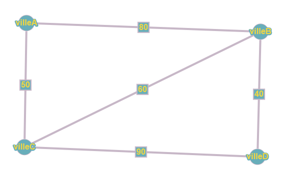
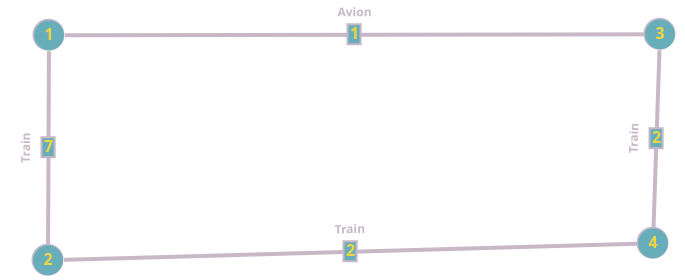
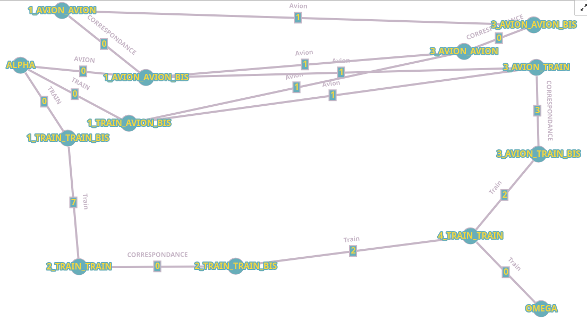
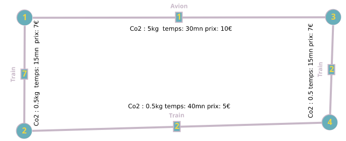

SAE S2.02 -- Rapport pour la ressource Graphes
===

Fryson Adrien et Roget Benjamin, Groupe B6


Version 1 : un seul moyen de transport
---

*Cette section traite uniquement de la Version 1 du projet.*


### Présentation d'un exemple

*Présenter un exemple concret de problème (données complètes pour la plateforme avec tous les moyens de transport, préférences de l'utilisatrices qui comprennent le moyen de transport choisi, le critère d'optimisation, et nombre d'itinéraires demandés).*
*Donner la solution du problème du point de vue de l'utilisatrice, càd quels sont les itinéraires possibles, quels sont les meilleurs itinéraires et pourquoi.*
*Pour l'instant on ne parle pas de graphes; on peut éventuellement faire des schémas.*

Prenons comme exemple un utilisateur pressé, car sa voiture vient de tomber en panne. Il souhaite atteindre le plus rapidement possible la ville D où se trouve son lieu de travail. Il se trouve actuellement dans la ville A. De plus, l'utilisateur a peur de l'avion, il ne peut donc emprunter que le train.

Les choix à sa disposition peuvent être illustrés comme suit :


Son meilleur choix ici serait de passer par la ville B pour arriver ensuite à la ville D. Il aurait alors un trajet de 120 minutes en évitant l'avion. Les trajets les plus courts en termes de nombre d'étapes sont au minimum de 2 étapes, et le temps minimum pour un trajet de 2 étapes est de 120 minutes. L'autre chemin possible de 2 étapes prend 140 minutes.

On pourrait imaginer passer par un chemin avec 3 étapes, mais les deux choix disponibles ont un temps minimum de 150 minutes. Le seul choix logique est donc le chemin de 120 minutes.

### Modèle pour l'exemple

*Donner le graphe modélisant l'exemple ci-dessus.*


*Donner la solution du problème (càd les meilleurs itinéraires) en tant que chemins dans le graphe.*
Les quatres itinéraire possible sont :
1) TRAIN de villeA à villeD en passant par villeB totale: 120.0 min         [A,B,D]
2) TRAIN de villeA à villeD en passant par villeC totale: 140.0 min         [A,C,D]
3) TRAIN de villeA à villeD en passant par villeC, villeB totale: 150.0 min [A,C,B,D]
4) TRAIN de villeA à villeD en passant par villeB, villeC totale: 230.0 min [A,B,C,D]
### Modélisation pour la Version 1 dans le cas général

*Expliquer de manière abstraite comment, étant donné un problème de recherche d'itinéraire (plateforme avec tous types de lignes, moyen de transport choisi, critère d'optimisation, nombre d'itinéraires demandés) on peut construire un graphe permettant de résoudre le problème de recherche d'itinéraire. C'est à dire:*
- *quels sont les sommets du graphe par rapport aux données du problème*, 
- *quelles sont ses arêtes, par rapport aux données du problème*, 
- *comment sont définis les poids des arêtes*,
- *quel algorithme sur les graphes permet de résoudre le problème d'itinéraire (nom de l'algorithme, arguments).*

*Utiliser un vocabulaire précis sur les graphes.*

Les sommets inclus dans le graphe sont les mêmes que dans les données, et les arêtes sont initialement les mêmes que dans les données. Lorsque l'utilisateur indique qu'il ne souhaite utiliser que le train, le graphe est recréé pour n'inclure que les arêtes utilisant ce moyen de transport. 
  Pour modéliser ce problème, nous simulons un unique graphe qui utilise trois autres graphes pour résoudre les problèmes. Chaque sous-graphe représente un critère, ce qui permet que le poids des arêtes reste fidèle aux données initiales.

L'algorithme qui doit être utilisé pour résoudre ce problème est l'algorithme de Dijkstra. Il prend en paramètre un graphe avec uniquement des poids positifs et un sommet de départ.

### Implémentation de la Version 1

*Écrire une classe de test qui reprend l'exemple, définit toutes les données de la plateforme, construit le graphe et calcule la solution.*
*Votre classe peut utiliser des assertions (test unitaire) ou bien afficher la solution.*
*Donner ici le VoyageurTest.java, **VoyageurTest.java**, **18/05/2024** **b2d69ddab6a21c695e3e3c46b06dad4157fdb7d2** et un **https://gitlab.univ-lille.fr/sae2.01-2.02/2024/B6/-/blob/b2d69ddab6a21c695e3e3c46b06dad4157fdb7d2/tests/graphes/v1/VoyageurTest.java***.

*On insiste sur l'importance de spécifier le commit. En effet, quand vous commencerez la Version 2, le code utilisé pour le test de la Version 1 sera modifié. Il se peut que vous n'ayez pas le temps de finaliser la Version 2 et vous retrouver avec un code qui ne marche pas même pour la Version 1. C'est pourquoi il est important de rédiger le rapport au fur et à mesure et de donner ici un lien vers la version de votre code qui marche pour la Version 1 du projet.*


Version 2 : multimodalité et prise en compte des correspondances
---

*Cette section explique la solution pour la Version 2 du projet.*

### Présentation d'un exemple

*Présenter un exemple concret (plateforme, couts de correspondance, critère d'optimalité).*
*Donner la solution du problème du point de vue de l'utilisatrice (quels sont les itinéraires possibles, lesquels sont optimaux et pourquoi).*
*Il est possible d'utiliser le même exemple que pour la Version 1 ou le modifier si pertinent.*

Dans cet exemple, l'utilisateur n'est intéressé que par un seul critère et est capable de prendre n'importe quel moyen de transport. Il cherche à se rendre de la ville 1 à la ville 4. Sachant qu'il y a une correspondance à la ville 3 donnant un malus de 3, le meilleur chemin est 1 -> 3 -> 4 (6). Ce chemin permet d'optimiser le trajet, peu importe le moyen de transport.Le deuxieme meilleur chemin implique de faire des allez retour entre 1 et 3, ce qui donnerait : 1 -> 3 -> 1 -> 3 -> 4 (8).
   L'autre chemin passant par la ville 2 n'a pas de malus de correspondance, mais il est le plus long (poids de 9) parmi les chemins possibles (sans compter les chemin qui ont une boucle).

### Modèle pour l'exemple

*Donner le graphe modélisant l'exemple ci-dessus.*
*Donner la solution du problème (càd les meilleurs itinéraires) en tant que chemins dans le graphe.*



Pour modéliser ce problème, nous avons décidé de représenter les correspondances par des arêtes entre deux sommets précis. Ainsi, chaque correspondance se trouve entre un sommet et un autre ayant le suffixe '_BIS'. Ici, l'utilisateur partant de ALPHA devra suivre le chemin suivant pour obtenir le plus court trajet :

```ALPHA -> 1_TRAIN_AVION_BIS -> 3_AVION_TRAIN -> 3_AVION_TRAIN_BIS -> 4_TRAIN_TRAIN -> OMEGA```

Ce chemin a un poids de 6 et correspond à l'exemple ci-dessus. 
Le second est :
```ALPHA -> 1_TRAIN_AVION_BIS -> 3_AVION_AVION -> 3_AVION_AVION_BIS -> 1_AVION_AVION -> 1_AVION_AVION_BIS -> 3_AVION_TRAIN_BIS -> 4_TRAIN_TRAIN -> OMEGA```


Le dernier meilleur chemin est :

```ALPHA -> 1_TRAIN_TRAIN_BIS -> 2_TRAIN_TRAIN -> 2_TRAIN_TRAIN_BIS -> 4_TRAIN_TRAIN -> OMEGA```

Ce modèle permet de bien représenter les correspondances et d'optimiser le trajet en fonction des critères donnés.

À noter qu'ALPHA est directement lié aux '_BIS' pour éviter les coûts de correspondance de la ville de départ. OMEGA esquive également les '_BIS' pour les mêmes raisons. Donc, dans les chemins ci-dessus, la modalité d'arrivée du premier sommet que l'on atteint en partant d'ALPHA n'a aucune importance et pourrait donc être BUS, TRAIN, ou encore AVION. Le même principe s'applique pour OMEGA, mais concernant les modalités de départ des sommets le précédant.

Chaque nom de lieu suit ce format : NOM_ModArr_ModDep(_BIS), où ModArr est le moyen de transport permettant d'atteindre ce lieu et ModDep est le moyen de transport quittant ce lieu.

### Modélisation pour la Version 2 dans le cas général

*Mêmes questions que pour la section correspondante de la Version 1, mais cette fois-ci les données d'entrée contiennent aussi des couts de correspondance.*
*Vous pouvez expliquer l'entièreté de la solution pour la Version 2, ou bien indiquer **clairement** les différences par rapport à la solution proposée pour la Version 1.*

D'abord, pour construire notre graphe, nous commençons par construire les correspondances. Pour cela, nous créons d'abord, pour chaque correspondance renseignée, un premier lieu nommé suivant le format expliqué ci-dessus, que nous lions à un autre sommet portant le même nom suivi du suffixe _BIS. Nous donnons a cette arrete le poids correspondant au critère demandé. Le moyen de transport de cette arête n'a pas d'importance.

Après avoir créé toutes les correspondances renseignées, nous créons toutes les correspondances non renseignées avec tous les moyens de transport possibles en attribuant un poids nul.

Ensuite, nous créons les différentes routes possibles entre les villes. Il faut tout particulièrement faire attention à ce que les modalités de départ des villes de départ soient égales aux modalités d'arrivée des villes d'arrivée, sinon les coûts de correspondance seront incohérents.

Enfin, pour résoudre le problème, il ne reste plus qu'à lier le sommet ALPHA à tous les lieux de la ville de départ possédant le suffixe '_BIS'. Puis, lier le sommet OMEGA aux sommets de la ville de destination ne possédant pas ce suffixe. Ensuite, il faut lancer l'algorithme de Dijkstra en lui fournissant le graphe ainsi que la ville de départ.

### Implémentation de la Version 2

*Écrire une classe de test qui reprend l'exemple, définit toutes les données de la plateforme, construit le graphe et calcule la solution.*
*Votre classe peut utiliser des assertions (test unitaire) ou bien afficher la solution.*
*Donner ici le **VoyageurTestReadMe.java**, **06/06/2024** **6edb7bbf481c3f304eb5a45ff5be5d48a7310751** et un **https://gitlab.univ-lille.fr/sae2.01-2.02/2024/B6/-/blob/6edb7bbf481c3f304eb5a45ff5be5d48a7310751/tests/graphes/VoyageurTestReadMe.java***.
*En particulier, il peut s'agir de la même classe que celle donnée pour la Version 1, mais un commit différent.*


Version 3 : optimisation multi-critères
---

### Présentation d'un exemple


Dans cet exemple, l'utilisateur est intéressé par plusieurs critères et est capable de prendre n'importe quel moyen de transport. Il cherche à se rendre de la ville 1 à la ville 4. Sachant qu'il y a une correspondance à la ville 3 donnant un malus de 3 dans tous les critères. Admettons que l'utilisateur ait un ordre de préférence : (CO2 > prix > temps).

Alors, une bonne solution serait le chemin 1 -> 2 -> 4 car il permet de minimiser à la fois le premier et le second critère (1 kg de CO2, 55 min et 12 €). L'autre chemin 1 -> 3 -> 4 correspond beaucoup moins bien aux critères de l'utilisateur (8,5 kg de CO2, 48 min et 20 €). Si l'utilisateur avait donné une plus grande importance au temps de trajet, alors sans doute que le second chemin aurait été le meilleur.


Pour modéliser ce problème, nous avons décidé de représenter les correspondances par des arêtes entre deux sommets précis. Ainsi, chaque correspondance se trouve entre un sommet et un autre ayant le suffixe '_BIS'. Ici, l'utilisateur partant de ALPHA devra suivre le chemin suivant pour obtenir le plus court trajet en optimisant les critere suivant cette ordre (Co2 > prix > temps):

```ALPHA -> 1_TRAIN_TRAIN_BIS -> 2_TRAIN_TRAIN -> 2_TRAIN_TRAIN_BIS -> 4_TRAIN_TRAIN -> OMEGA```

Ce trajet emets 1kg de Co2, prend 55mn et coute 12€.

Le dernier meilleur chemin est :

```ALPHA -> 1_TRAIN_AVION_BIS -> 3_AVION_TRAIN -> 3_AVION_TRAIN_BIS -> 4_TRAIN_TRAIN -> OMEGA```
avec une emission de 8.5kg de Co2, 48mn et 17€.

Ce modèle permet de bien représenter les correspondances et d'optimiser le trajet en fonction des critères donnés.

À noter qu'ALPHA est directement lié aux '_BIS' pour éviter les coûts de correspondance de la ville de départ. OMEGA esquive également les '_BIS' pour les mêmes raisons. Donc, dans les chemins ci-dessus, la modalité d'arrivée du premier sommet que l'on atteint en partant d'ALPHA n'a aucune importance et pourrait donc être BUS, TRAIN, ou encore AVION. Le même principe s'applique pour OMEGA, mais concernant les modalités de départ des sommets le précédant.

Chaque nom de lieu suit ce format : NOM_ModArr_ModDep(_BIS), où ModArr est le moyen de transport permettant d'atteindre ce lieu et ModDep est le moyen de transport quittant ce lieu.

Pour hiérarchiser les chemins entre eux du meilleur selon les critères donnés au pire, nous avons opté pour un système de score.

Pour calculer le score, nous suivons cette formule : c = (p1c1) + (p2c2) + (p3c3) où c est le score attribué au chemin, p1, p2 et p3 sont les poids pondérés du chemin suivant les différents critères, et c1, c2 et c3 sont les coefficients que l'on donne à chaque critère avec c1 + c2 + c3 = 1.

Pour calculer les p, on suit cette formule : p = v/pmax, où p est le poids pondéré, v est la valeur du poids, et pmax est une constante représentant le poids maximum. Cette valeur est arbitraire et doit être choisie judicieusement pour pouvoir avoir un classement cohérent.

Si l'on reprend notre exemple, disons que le temps maximum est de 960 min, le prix maximum 750 € et les émissions maximales de 450 kg.

Pour les coefficients, nous décidons de leur donner ces valeurs : c1 = 0.6, c2 = 0.35 et c3 = 0.05.

Calculons le score du premier chemin de l'exemple :
Nous avons, dans l'ordre d'importance des critères pour le CO2, p1 = 1 / 450, p2 = 12 / 750 et p3 = 55 / 960.
Nous avons alors C = 0.6*(1/450) + 0.35*(12/750) + 0.05*(55/960) = 0.00979.

Le score du meilleur chemin est donc de 0.00979.
Le score du deuxième chemin est de 0,0231.
Nous avons donc bien le score du premier chemin inférieur au second, ce qui nous permet d'arriver aux mêmes conclusions que dans l'exemple.


*Votre classe peut utiliser des assertions (test unitaire) ou bien afficher la solution.*
*Donner ici le **nom complet de la classe**, **la date et l'identifiant du commit à regarder** et un **lien vers la page de cette classe sur gitlab qui correspond au bon commit***.


----------------------------------------------------

**Fin du rapport**

### Barème sur 30 pts

Toute question sur le barème est à adresser à iovka.boneva@univ-lille.fr


- Rapport non rendu à temps -> note 0 
- **(7, décomposé comme suit)** Divers
  - **(1,5)** Respect de la structure du rapport
  - **(1,5)** Section Version 1 rendue pour le 18/05/2024. Cette version peut contenir les parties en italique.
  - **(1,5)** Section Version 2 rendue pour le 08/06/2024. Cette version peut contenir les parties en italique.
  - **(1)** Utilisation de vocabulaire précis sur les graphes (termes vu en cours, noms des algorithmes, etc.)
  - **(1,5)** Style d'écriture fluide et compréhensible

- **(8, décomposé comme suit)** Solution pour la Version 1
  - **(2)** Exemple pertinent (illustre tous les aspects du problème) et lisible (en particulier, ni trop grand ni trop petit, bien présenté)
  - **(4)** Le modèle de l'exemple permet de trouver la solution sur l'exemple. La modélisation pour le cas général permet de résoudre le problème posé
  - **(2)** L'implémentation de l'exemple est correcte et fonctionnelle

- **(6, décomposé comme suit)** Solution pour la Version 2
  - **(1)** Exemple pertinent
  - **(4)** le modèle de l'exemple permet de trouver la solution sur l'exemple. La modélisation pour le cas général permet de résoudre le problème posé
  - **(1)** L'implémentation de l'exemple est correcte et fonctionnelle

- **(3)** Qualité de la description de la solution (concerne les sections "Modèlisation dans le cas général" pour les Versions 1 et 2):
  - La modélisation pour le cas général est décrite de manière abstraite mais précise et complète. Pour vous donner une idée, un·e étudiant·e de BUT qui a validé les ressources Graphes et Dev devrait être en mesure d'implémenter votre solution d'après la description que vous en faites, sans avoir à trop réfléchir.

- **(6)** Solution pour la Version 3: mêmes critères que pour la Version 2
